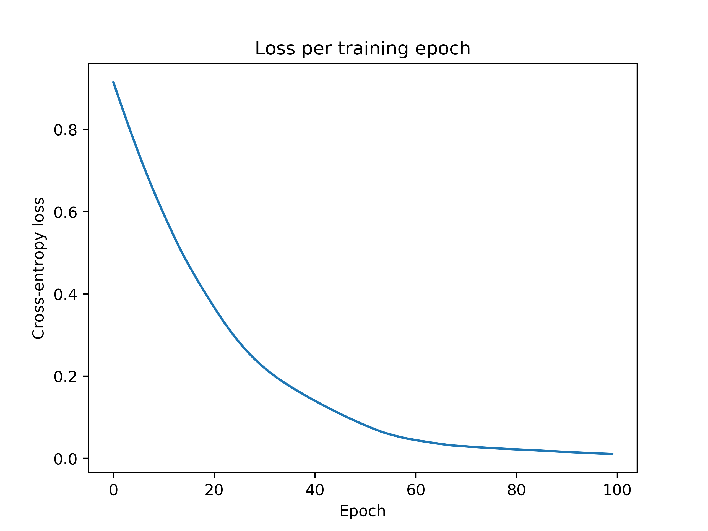

# Week 2: The XOR Problem

## Introduction
The XOR problem is a key bit of knowledge in classic deep learning theory. "XOR" is short for "exclusive or". 
In this context, it is an operation between two binary inputs that produces a "1" when the two inputs are different and
a "0" if the two outputs are the same. This results in the following data:

| x1        | x2           | y  |
| ------------- |:-------------:| -----:|
| 0      | 1 | 1 |
| 1    | 0      |   1 |
| 1 | 1      |    0 |
| 0 | 0 | 0|

This is an important problem because the two classes for `y` are not linearly separable given the inputs `x1` and `x2`. 

Based on some earlier research by [McCulloch and Pitts (1943)](https://www.cs.cmu.edu/~./epxing/Class/10715/reading/McCulloch.and.Pitts.pdf),
 Frank Rosenblatt developed the first idea of a 
"perceptron" in his book _Principles of Neurodynamics_ (1962). The original perceptron had a single layer where the 
inputs, , were multiplied by an individual weight,
, and summed. If the sum exceed some value, a non-0 output 
was made. According to [this](https://web.csulb.edu/~cwallis/artificialn/History.htm#_ftn2) source, the "threshold step"
function was originally used.

In one of the original artificial intelligence textbooks, _Perceptrons: an introduction to computational geometry_, by Marvin Minsky and Seymour Papert (1969), 
the perceptron model was criticized for being unable to solve problems that are not linearly separable. In a perhaps
hasty manner, Minsky and Papert claimed that research being done on perceptrons was all for naught. 

What Minsky and Papert failed to see was that a simple addition to the basic perceptron would allow for it to solve such 
problems. Simply by adding an additional "hidden" layer (between the input and output layers) that passes its product 
to the output layer through a nonlinear activation function, the XOR problem can be solved. 
This small idea lead to the "Universal Approximation Theoreom", which states that "a feed-forward network with a
single hidden layer containing a finite number of neurons can approximate any arbitrary real-valued, continuous function
on compact sets of ". This theorem was
proven to be true for networks with sigmoid activation functions in [1989 
by George Cybenko](http://citeseerx.ist.psu.edu/viewdoc/download?doi=10.1.1.441.7873&rep=rep1&type=pdf)
 and then later proven to be true for any 3-layer neural network by [Kurt Kornik in 1991](https://www.sciencedirect.com/science/article/abs/pii/089360809190009T?via%3Dihub).

## What's in this directory?
This directory contains a from-scratch implementation of:
* Dense neural network (1 hidden layer)
    * week2/nn.py
* ADAM optimizer
    * week2/optimizer.py
    * Based on: https://arxiv.org/abs/1412.6980
* Backpropagation
    * week2/nn.get_gradient() + week2/optimizer.update_weights()
* Cross entropy loss
    * week2/loss.py


## Using the network
The NN class has been inplemented to allow for a custom input size, output size, and number of hidden units.
For our XOR problem, please use an input size of 2 and output size of 2. You can use whatever number of hidden
units you would like.

For ADAM, the generally recommended hyperparameter values are as follows:
*  = 0.01
*  = 0.99
*  = 0.999
*  = 0.00001  

The `xor_problem.py` script performs the training loop and outputs a graph of the loss function 
to ```./week2/media/xor_loss.png```

The below code snippet shows the initialization of the NN class with an input vector of size 2, 
10 hidden units, and producing 2 outputs per example in the batch. This results in the softmax function producing a
predicted probability for each class for each example. Finally, the NN class is given the seed 111 for 
reproducability.

The second line initializes the ADAM optimizer with the recommended hyperparameters from above.

The "for loop" controls the number of epochs. The .forward_pass() method of the NN class produces an output
matrix and the .softmax() method passes that matrix through the softmax function.

The next line computes the cross-entropy loss between the forward pass and the corresponding training labels.

The following line calculates the gradient of the neural network via a backward pass (explained more in depth
in the following section).

This gradient, along with the network's current weights, are passes to the ADAM optimizer and the weights are
updated.
```python
nn = NN(input_length=2, n_hidden_units=10, n_outputs=2, seed=111)
adam = ADAM(layer_dims=nn.layer_dims, alpha=0.01, beta_m=0.99, beta_v=0.999, epsilon=0.00001)

for _ in range(100):
    output = nn.forward_pass(input=train_samples)
    sm_output = nn.softmax(input=output)
    loss = cross_entropy_loss(y_pred=sm_output, y_actual=train_labels)
    grad = nn.get_gradient(input=train_samples, y_pred=sm_output, y_actual=train_labels)
    adam.update_weights(weights=nn.weights, gradient=grad)
```

Finally, here is the loss function of the network after 100 epochs of training:
<p align="center">
  
  </a>
</p>

After running `xor_problem.py`, you will see three messages printed to your console. The first will show your trained 
network's predictions on the input data. The second are the true values. The third is explicit confirmation of whether or not
your network has solved the XOR problem.

### Derivation of the backprop algorithm
(Hopefully this renders well. Github doesn't support rendering LaTeX natively.)

You can find the code for this in the ```.get_gradient()``` method of the NN class.
![](https://latex.codecogs.com/gif.latex?%5Cdpi%7B150%7D%20%5Cbegin%7Balign*%7D%20%5Chat%7By%7D%20%26%3D%20softmax%28ReLU%28%5Cboldsymbol%7Bx%7D%5Cboldsymbol%7BW%7D_%7B0%7D%20&plus;%20%5Cboldsymbol%7Bb%7D_%7B0%7D%29%5Cboldsymbol%7BW%7D_%7B1%7D%20&plus;%20%5Cboldsymbol%7Bb%7D_%7B1%7D%29%20%5C%5C%20a_0%20%26%3D%20ReLU%28%5Cboldsymbol%7Bx%7D%5Cboldsymbol%7BW%7D_%7B0%7D%20&plus;%20%5Cboldsymbol%7Bb%7D_%7B0%7D%29%5C%5C%20%5Cfrac%7B%5Cpartial%20L%7D%7B%5Cpartial%20%5Cboldsymbol%7Bb%7D_1%7D%20%26%3D%20%5Chat%7By%7D%20-%20y%20%5C%5C%20%5Cfrac%7B%5Cpartial%20L%7D%7B%5Cpartial%20%5Cboldsymbol%7BW%7D_1%7D%20%26%3D%20a_%7B0%7D%5E%7BT%7D%5Cfrac%7B%5Cpartial%20L%7D%7B%5Cpartial%20%5Cboldsymbol%7Bb%7D_1%7D%5C%5C%20%5Cfrac%7B%5Cpartial%20L%7D%7B%5Cpartial%20%5Cboldsymbol%7Bb%7D_0%7D%20%26%3D%20%5Cfrac%7B%5Cpartial%20L%7D%7B%5Cpartial%20%5Cboldsymbol%7Bb%7D_1%7D%20%5Cboldsymbol%7BW%7D_%7B1%7D%5E%7BT%7D%5C%5C%20%5Cfrac%7B%5Cpartial%20L%7D%7B%5Cpartial%20%5Cboldsymbol%7BW%7D_0%7D%20%26%3D%20%5Cboldsymbol%7Bx%7D%5E%7BT%7D%5Cfrac%7B%5Cpartial%20L%7D%7B%5Cpartial%20%5Cboldsymbol%7Bb%7D_0%7D%5C%5C%20%5Cend%7Balign*%7D)

You will notice that the derivative of the softmax function simplifies to .
This is one of the many nice properties of the softmax function. For the proof of this derivation, see [this source](https://www.ics.uci.edu/~pjsadows/notes.pdf) (Page 3, eqn's 17-27).