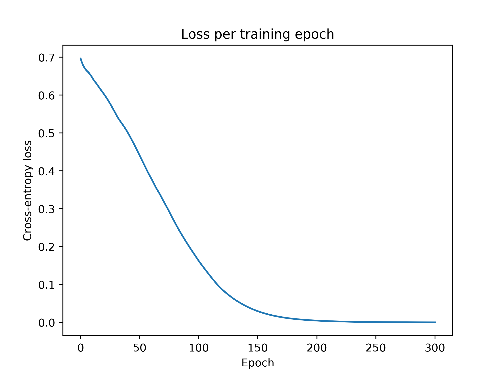

# Week 2: The XOR Problem

## Introduction
The XOR problem is a key bit of knowledge in classic deep learning theory. "XOR" is short for "exclusive or". 
In this context, it is an operation between two binary inputs that produces a "1" when the two inputs are different and
a "0" if the two outputs are the same. This results in the following data:

| x1        | x2           | y  |
| ------------- |:-------------:| -----:|
| 0      | 1 | 1 |
| 1    | 0      |   1 |
| 1 | 1      |    0 |
| 0 | 0 | 0|

This is an important problem because the two classes for `y` are not linearly separable given the inputs `x1` and `x2`. 

Based on some earlier research by [McCulloch and Pitts (1943)](https://www.cs.cmu.edu/~./epxing/Class/10715/reading/McCulloch.and.Pitts.pdf),
 Frank Rosenblatt developed the first idea of a 
"perceptron" in his book _Principles of Neurodynamics_ (1962). The original perceptron had a single layer where the 
inputs, , were multiplied by an individual weight,
, and summed. If the sum exceed some value, a non-0 output 
was made. According to [this](https://web.csulb.edu/~cwallis/artificialn/History.htm#_ftn2) source, the "threshold step"
function was originally used.

In one of the original artificial intelligence textbooks, _Perceptrons: an introduction to computational geometry_, by Marvin Minsky and Seymour Papert (1969), 
the perceptron model was criticized for being unable to solve problems that are not linearly separable. In a perhaps
hasty manner, Minsky and Papert claimed that research being done on perceptrons was all for naught. 

What Minsky and Papert failed to see was that a simple addition to the basic perceptron would allow for it to solve such 
problems. Simply by adding an additional "hidden" layer (between the input and output layers) that passes its product 
to the output layer through a nonlinear activation function, the XOR problem can be solved. 
This small idea lead to the "Universal Approximation Theoreom", which states that "a feed-forward network with a
single hidden layer containing a finite number of neurons can approximate any arbitrary real-valued, continuous function
on compact sets of ". This theorem was
proven to be true for networks with sigmoid activation functions in [1989 
by George Cybenko](http://citeseerx.ist.psu.edu/viewdoc/download?doi=10.1.1.441.7873&rep=rep1&type=pdf)
 and then later proven to be true for any 3-layer neural network by [Kurt Kornik in 1991](https://www.sciencedirect.com/science/article/abs/pii/089360809190009T?via%3Dihub).

## What's in this directory?
This directory contains a from-scratch implementation of:
* Dense neural network (1 hidden layer)
    * week2/nn.py
* ADAM optimizer
    * week2/optimizer.py
    * Based on: https://arxiv.org/abs/1412.6980
* Backpropagation
    * week2/nn.get_gradient() + week2/optimizer.update_weights()
* Cross entropy loss
    * week2/loss.py
* MiniBatcher
    * week2/batching.py


## Using the network
The NN class has been inplemented to allow for a custom input size, output size, and number of hidden units.
For our XOR problem, please use an input size of 2 and output size of 2. You can use whatever number of hidden
units you would like.

For ADAM, the generally recommended hyperparameter values are as follows:
*  = 0.01
*  = 0.99
*  = 0.999
*  = 0.00001  

The `xor_problem.py` script performs the training loop and outputs a graph of the loss function 
to ```./week2/media/xor_loss.png```

The code snippet below shows the entirety of the training loop. Line one shows the initialization of the NN class with an input vector of size 2, 
10 hidden units, and producing 2 outputs per example in the batch. This results in the softmax function producing a
predicted probability for each class for each example. Finally, the NN class is given the seed 1111 for 
reproducability.

The second line initializes the Adam optimizer with the recommended hyperparameters from above.

Line 3 initializes our MiniBatcher class with a batch size of 4 and a seed of 111 for
reproducability.

Lines 7-9 set up some ultilies for our training, namely a list to store our losses at each
training step, the number of epochs we want to run, and an epoch counter that is used to 
halt the training once the desired number of epochs is met.

The first step inside of our training loop (line 13) grabs a minibatch from our training
data and ground-truth labels. 

Lines 17-20 are used to help reset our MiniBatcher once the epoch has finished. For specific
details, see the class description in the `batching.py` file.

Line 22 computes a forward pass of the data through the nextwork, which is combined with
line 23 which computes the softmax of that forward pass output.

Line 24 calculates the Cross Entropy of the training step, which is then loaded into our
loss history tracker at line 27.

Line 25 computes the gradient of the network.

Line 26 takes the network's weights and the gradient and updates the weights of the network.

```python class:"lineNo"
1   nn = NN(input_length=2, n_hidden_units=10, n_outputs=2, seed=1111)
2   adam = ADAM(layer_dims=nn.layer_dims, alpha=0.01, beta_m=0.99, beta_v=0.999, epsilon=0.00001)
3   mb = MiniBatcher(data=train_samples, labels=train_labels, batch_size=4, seed=111)
4
5   # Running our training loop for 100 epochs with the entirety of our training data at each batch
6   # We'll also be keeping track of our loss at each step...
7   historical_losses = list()
8   EPOCHS = 150
9   epoch_counter = 0
10
11  while epoch_counter < EPOCHS:
12      # Grabbing a mini-batch
13      X_mb, y_mb = mb.fetch_minibatch()
14
15      # Explicit check to see if we have run out of data
16      # If so, increment the epoch and reset the MiniBatcher
17      if np.any([isinstance(X_mb, bool), len(X_mb) == 0]):
18          epoch_counter += 1
19          mb.new_epoch()
20          X_mb, y_mb = mb.fetch_minibatch()
21
22      output = nn.forward_pass(input=X_mb)
23      sm_output = nn.softmax(input=output)
24      loss = cross_entropy_loss(y_pred=sm_output, y_actual=y_mb)
25      grad = nn.get_gradient(input=X_mb, y_pred=sm_output, y_actual=y_mb)
26      adam.update_weights(weights=nn.weights, gradient=grad)
27      historical_losses.append(loss)
```

Finally, here is the loss function of the network after 300 epochs of training:
<p align="center">
  
  </a>
</p>

After running `xor_problem.py`, you will see three messages printed to your console. The first will show your trained 
network's predictions on the input data. The second are the true values. The third is explicit confirmation of whether or not
your network has solved the XOR problem.

### Derivation of the backprop algorithm
(Hopefully this renders well. Github doesn't support rendering LaTeX natively.)

Note that my network input uses matrices that have features in the columns. More on that 
[here](https://medium.com/from-the-scratch/deep-learning-deep-guide-for-all-your-matrix-dimensions-and-calculations-415012de1568).

You can find the code for this in the ```.get_gradient()``` method of the NN class.
![](https://latex.codecogs.com/png.latex?%5Cdpi%7B150%7D%20%5Cbegin%7Balign*%7D%20%5Chat%7By%7D%20%3D%20softmax%28ReLU%28X%20%26%20W%5E%7B%5B0%5D%7D%20&plus;%20b%5E%7B%5B0%5D%7D%29W%5E%7B%5B1%5D%7D%20&plus;%20b%5E%7B%5B1%5D%7D%29%20%5C%5C%20z%5E%7B%5B%5Cell%5D%7D%20%3D%20a%5E%7B%5B%5Cell-1%5D%7D%20%26%20W%5E%7B%5B%5Cell%5D%7D%20&plus;%20b%5E%7B%5B%5Cell%5D%7D%20%5C%5C%20a%5E%7B%5B%5Cell%5D%7D%20%3D%20%26g%5E%7B%5B%5Cell%5D%7D%20%28z%5E%7B%5B%5Cell%5D%7D%29%20%5C%5C%20%5Cdelta%5E%7B%5Boutput%5D%7D%20%3D%20%5Cnabla_%7Boutput%7D%20%26%20%5Cmathcal%7BL%7D%28%5Chat%7By%7D%2Cy%29%20%3D%20%5Chat%7By%7D%20-%20y%5C%5C%20%5Cdelta%5E%7B%5B%5Cell%5D%7D%20%3D%20%28%5Cdelta%5E%7B%5B%5Cell&plus;1%5D%7D%20%26%20W%5E%7B%5B%5Cell&plus;1%5D%5Cintercal%7D%29%20%5Codot%20g%5E%7B%5Cprime%5B%5Cell%5D%7D%28z%5E%7B%5B%5Cell%5D%7D%29%5C%5C%20%5Cnabla_%7Bb%5E%7B%5B%5Cell%5D%7D%7D%20%26%3D%20%5Cdelta%5E%7B%5B%5Cell%5D%7D%5C%5C%20%5Cnabla_%7BW%5E%7B%5B%5Cell%5D%7D%7D%20%3D%20%26a%5E%7B%5B%5Cell-1%5D%5Cintercal%7D%20%5Cdelta%5E%7B%5B%5Cell%5D%7D%20%5Cend%7Balign*%7D)

where where  
is the activation function of layer 
, 

for the input layer is our mini-batch of data 
, and 

denotes the elementwise product.
You will notice that the derivative of the softmax function simplifies to .
This is one of the many nice properties of the softmax function. For the proof of this derivation, see [this source](https://www.ics.uci.edu/~pjsadows/notes.pdf) (Page 3, eqn's 17-27).

This gradient is then packed into a collection, 
, 
and passed to our ADAM algorithm as (```.update_weights()``` of the ADAM class):

![](https://latex.codecogs.com/png.latex?%5Cdpi%7B150%7D%20%5Cbegin%7Balign*%7D%20m_%7Bt%7D%5E%7B%28p%2C%5Cell%29%7D%20%5Cleftarrow%20%5Cbeta_%7Bm%7D%20m_%7Bt-1%7D%5E%7B%28p%2C%5Cell%29%7D%20%26&plus;%20%281%20-%20%5Cbeta_%7Bm%7D%29%20%5Cmathcal%7BG%7D_%7Bt%7D%5E%7B%28p%2C%5Cell%29%7D%20%5C%5C%20v_%7Bt%7D%5E%7B%28p%2C%5Cell%29%7D%20%5Cleftarrow%20%5Cbeta_%7Bv%7D%20v_%7Bt-1%7D%5E%7B%28p%2C%5Cell%29%7D%20%26&plus;%20%281%20-%20%5Cbeta_%7Bv%7D%29%20%5Cmathcal%7BG%7D_%7Bt%7D%5E%7B2%2C%20%28p%2C%5Cell%29%7D%20%5C%5C%20%5Chat%7Bm%7D_%7Bt%7D%5E%7B%28p%2C%5Cell%29%7D%20%5Cleftarrow%20m_%7Bt%7D%5E%7B%28p%2C%5Cell%29%7D%20%26/%20%281%20-%20%5Cbeta_%7Bm%7D%5E%7Bt%7D%29%20%5C%5C%20%5Chat%7Bv%7D_%7Bt%7D%5E%7B%28p%2C%5Cell%29%7D%20%5Cleftarrow%20v_%7Bt%7D%5E%7B%28p%2C%5Cell%29%7D%20%26/%20%281%20-%20%5Cbeta_%7Bv%7D%5E%7Bt%7D%29%20%5C%5C%20%5Cboldsymbol%7B%5Ctheta%7D%5E%7B%28p%2C%5Cell%29%7D_%7Bt%7D%20%5Cleftarrow%20%5Cboldsymbol%7B%5Ctheta%7D%5E%7B%28p%2C%5Cell%29%7D_%7Bt-1%7D%20-%20%26%5Calpha%5Cfrac%7B%5Chat%7Bm%7D_%7Bt%7D%5E%7B%28p%2C%5Cell%29%7D%7D%7B%5Csqrt%7B%5Chat%7Bv%7D_%7Bt%7D%5E%7B%28p%2C%5Cell%29%7D%7D%20&plus;%20%5Cepsilon%7D%20%5Cend%7Balign*%7D)

Where  
is our learning rate, 

is a small stability value, 

is our velocity coefficient, 

is our momentum coefficient, 

is our momentum matrix, 

is our velocity matrix, 

are the network's learnable parameters, and 

is the gradient matrix for parameter 
 (weights or biases) for layer 
, at step 
.